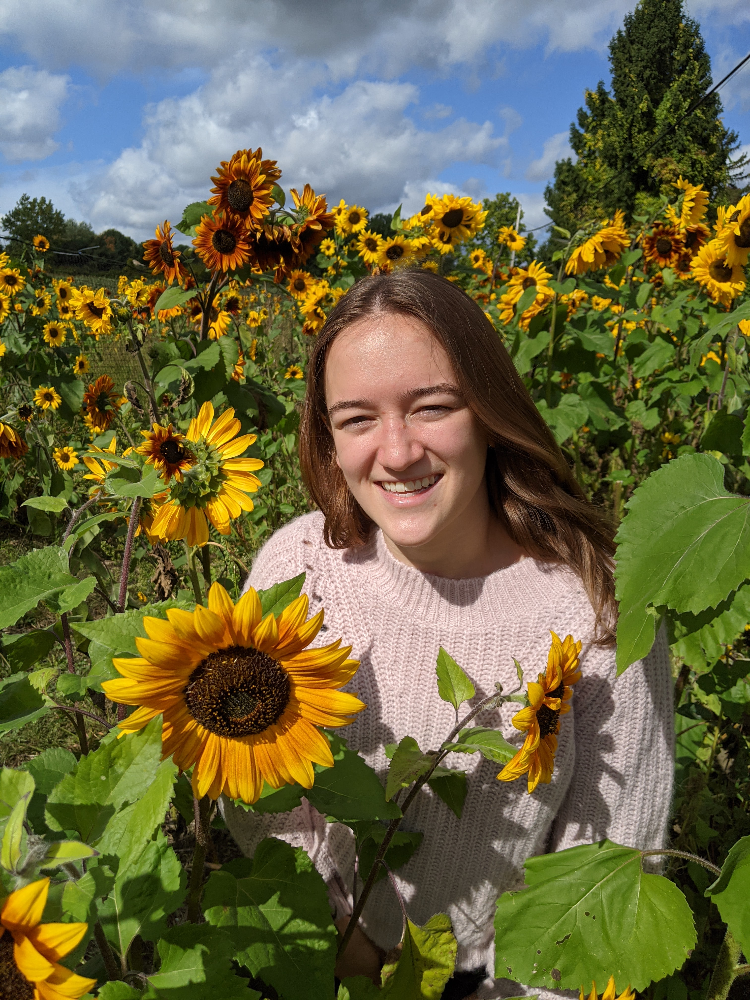

<!doctype html>
<html>
	<head>
		<link rel="preconnect" href="https://fonts.gstatic.com">
		<link href="https://fonts.googleapis.com/css2?family=Roboto+Mono&display=swap" rel="stylesheet">
		<link rel="stylesheet" type="text/css" href="style.css" media="screen"/>
	</head>
	<body>

		

			<h1>Veronica Wertz </h1>
			
 abc

			
		

		
 
			

				<h2> About Me </h2>
				
 Hi! I am a senior in the College of Engineering at Cornell University. 
					I am majoring in Information Science, Systems, and Technology with a specialization in Information Science, and minoring in Computer Science.
					My primary interests are in web development and data science. 
					In the summer of 2020, I worked as a software developer for Spectrum, creating a user interface for my team. 
					Working on this project helped me refine my web development skills and solidify my passion for web development. 
					Outside of my academic and professional interests, I am a leader of a dance club at Cornell, and do aerial arts in my free time! 
				

			

			

				
			

		

		

			<h2> Background </h2>
			

				

					

						<h3> Cornell University </h3>
						<h4> College of Engineering </h4>
						<h4> Ithaca, NY | 08/2017-Present </h4>
						<ul>
							<li> B.S. Information Science, Systems, and Technology: Information Science Specialization </li>
							<li>
								Relevant Courses: Object Oriented Programming and Data Structures, Engineering Probability and Statistics I & II, 
								Networks, Introduction to Data Science, Data-Driven Web Applications, Practical Tools for Operations Research/Machine Learning/Data Science, 
								Language and Information	
							</li>
						</ul>	
					

					

						<h3> Spectrum </h3>
						<h4> Software Developer </h4>
						<h4> Remote| 06/2020-07/2020</h4>
						<ul>
							<li> Designed and implemented an app where the user could trigger a series of jobs in a CI/CD pipeline with parameters. </li>
							<li> Used Python, Flask, HTML/CSS, Javascript, and Jenkins to develop a user-friendly UI to display real time information regarding that status and outcome of current and previous jobs. </li>
						</ul>
					

					

						<h3> Cornell University PSP </h3> 
						<h4> Teaching Assistant </h4>
						<h4> Ithaca, NY | 06/ 2019-08/2019 </h4>
						<ul>
							<li> Provided math instruction for a Chemistry course for incoming freshmen in the Pre-freshman Summer Program. Assisted a group of approximately 40 students in 
								understanding the mathematical concepts needed to be successful in chemistry. Helped write questions for in-class quizzes. 
								Graded weekly quizzes, entrance exams, and final exams. </li>
						</ul>
					

				

				

					
 Skills:

					
 Python, Javascript, HTML/CSS, MySQL, Java, C, PHP, AMPL, Tableau, Flask, Git  

				

			

		

		

			<h2> Projects </h2>
			

				

					<h3> Spectrum | Pipeline UI </h3>
					
 While working at Spectrum, I created a user interface for my team. 
						My team was working on a CI/CD pipeline and wanted the pipeline to have it's own UI. 
						I  had the opportunity to design and implement the UI on my own, which allowed me to practice both my design skills and technical skills. 
						The UI I created allowed the user to run the whole pipeline, or any individual job in the pipeline. 
						The user was also able to view currently building tasks and previously built tasks as well. 
						I included a loading page for the user to see which task was running, and a results page for the user to see the outcome of the task. 
						I learned many new things about Flask, especially using requests when running jobs and retrieving results. 
						Using HTML/CSS and Flask, I was able to develop a more aesthetically pleasing platform for my team to run their pipeline on. 
					

				

				

					<h3> Cornell Pole Posse Website </h3>
					
 
						I created a website for my dance group, Cornell Pole Posse.
						The club never had a website before, as it is a fairly small and newly revived club at Cornell. 
						This project started as a class project, but ended up being a passion project I worked on outside of class. 
						This website was the first website I created on my own. 
						I used HTML/CSS and PHP to create this website.  
						It includes general information about the club, information about practices, and a calendar of the club's events. 
					

				

			

		

		
		

			<h2> Contact Me </h2>
			
 <a href="https://www.linkedin.com/in/veronicawertz/"> LinkedIn </a> &#8226; veronica@wertz.com 

		

	</body>
</html>
